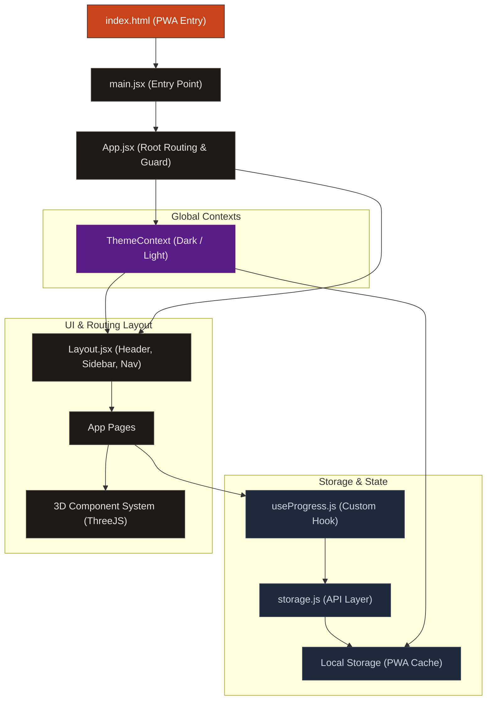
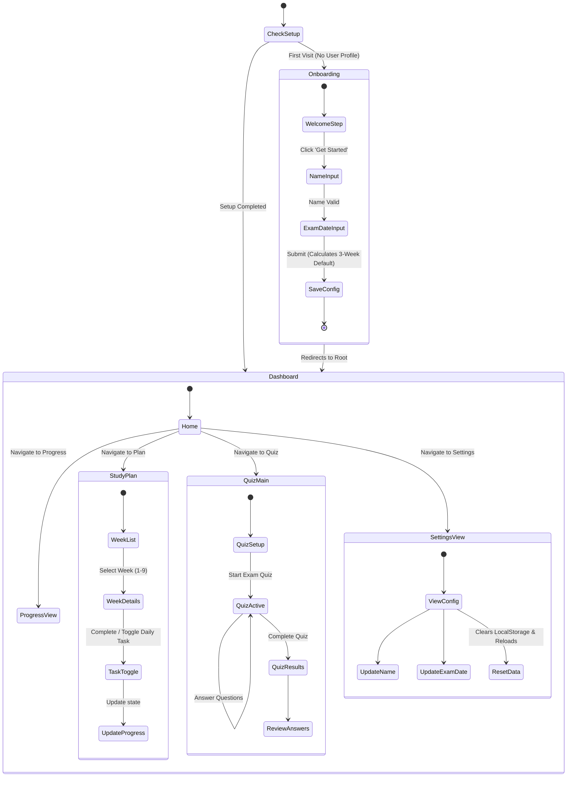

# AI Excellence LaunchPad — Architecture & Flow Diagrams

This document outlines the technical design, application architecture, and user workflow of the **AI Excellence LaunchPad** study tracker.

---

## 1. Application Architecture Diagram

The application is structured as a modern React Progressive Web App (PWA) client-side single-page application (SPA).

---

## 2. Navigation & User Flow Diagram

This flow diagram illustrates the user journey from onboarding to day-to-day study sessions, quiz practice, and progress tracking.

---

## 3. Technology Stack Reference

| Layer | Technology | Key Usage |
| :--- | :--- | :--- |
| **Framework Core** | React 19 + Vite 6 | Fast SPA rendering & hot-reloading dev loop. |
| **Theme System** | Tailwind CSS v4 + HSL | Dynamically inverting standard Tailwind colors. |
| **Routing** | React Router Dom v6 | Client-side routing, route guarding, and nested paths. |
| **3D Rendering** | Three.js + React Three Fiber | Renders responsive particle fields and the interactive Claude Orb. |
| **Caching & PWA** | Vite PWA Plugin + SW | Service Worker implementation for offline study capabilities. |
| **State Persistence** | browser LocalStorage | Keeps name, exam countdown, task checks, and quiz stats persistent. |
